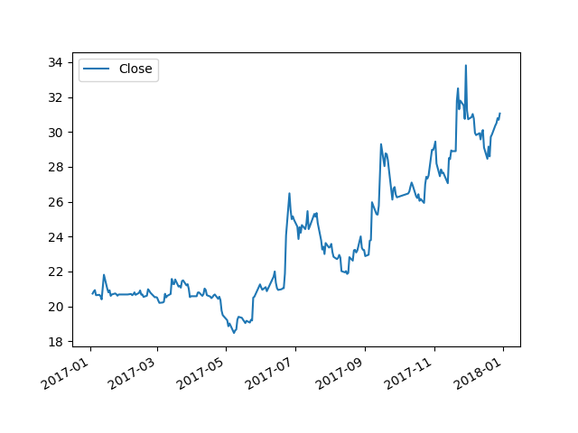

# pyfinance

学习 Finance For Python 的代码

udacity -> Machine Learning for Trading

## 相关资源：

* [Python金融大数据分析](https://item.jd.com/11808235.html) (京东商城)

* [pandas](pandas.pydata.org)

* [numpy](www.numpy.org)

* [Matplotlib](www.matplotlib.org)

---


#### 01-02 Working with multiple stocks

**读取多个股票数据到一个 `dataframe` ：**

- 使用 [pandas.date_range](http://pandas.pydata.org/pandas-docs/stable/generated/pandas.date_range.html) 设置一个日期区间
- 创建一个以 `date` 字段为索引的空白 `dataframe`
- 读取股票数据（使用 [pandas.DataFrame.dropna](http://pandas.pydata.org/pandas-docs/stable/generated/pandas.DataFrame.html) 丢弃 nan 数据）
- 使用 `[pandas.DataFrame.join](http://pandas.pydata.org/pandas-docs/stable/generated/pandas.DataFrame.join.html)` 将多个 `dataframe` 链接

**Once you have multiple stocks, you can:**

- Select a subset of stocks by ticker symbols
- Slice by row (dates) and column (symbols)
- Plot multiple stocks at once (still using [pandas.DataFrame.plot](http://pandas.pydata.org/pandas-docs/stable/generated/pandas.DataFrame.plot.html))
- Carry out arithmetic operations across stocks, e.g. normalize by the first day's price

#### 01-03 The power of Numpy

**Resources from NumPy [User Guide](http://docs.scipy.org/doc/numpy/user/index.html)and [Reference](http://docs.scipy.org/doc/numpy/reference/index.html):**

- [The N-dimensional array](http://docs.scipy.org/doc/numpy/reference/arrays.ndarray.html)
- [Data types](http://docs.scipy.org/doc/numpy/user/basics.types.html)
- [Array creation](http://docs.scipy.org/doc/numpy/user/basics.creation.html) [[more](http://docs.scipy.org/doc/numpy/reference/routines.array-creation.html)]
- [Indexing](http://docs.scipy.org/doc/numpy/user/basics.indexing.html) [[more](http://docs.scipy.org/doc/numpy/reference/arrays.indexing.html)]
- [Broadcasting](http://docs.scipy.org/doc/numpy/user/basics.broadcasting.html)
- [Random sampling](http://docs.scipy.org/doc/numpy/reference/routines.random.html)
- [Mathematical functions](http://docs.scipy.org/doc/numpy/reference/routines.math.html)
- [Linear algebra](http://docs.scipy.org/doc/numpy/reference/routines.linalg.html)

#### 01-05 Incomplete data

[课程6：01-05 Incomplete data 遇到不完整数据时的处理](classes/6.md)

#### 01-06 Histograms and scatter plots

通过绘制直方图获得以下数据：

* Standard deviation(标准差)

* mean(平均值)

* Kurtosis(峰度) - fat tails,skinny tails

  > 在统计学中，峰度（Kurtosis）衡量实数随机变量概率分布的峰态。峰度高就意味着方差增大是由低频度的大于或小于平均值的极端差值引起的。
  >
  > [统计学](https://baike.baidu.com/item/%E7%BB%9F%E8%AE%A1%E5%AD%A6)上两个极端值出现的风险
  >
  > http://estat.ncku.edu.tw/topic/desc_stat/base/Kurtosis.html
  >
  > [wikipedia](https://zh.wikipedia.org/wiki/%E5%B3%B0%E5%BA%A6)
  >
  > 尾端风险/极端风险(Tail Risk)是指统计学上两个极端值可能出现的风险，按照常态的钟型分布（Bell Shape），两端的分布机率是相当低的（Thin Tails）；但是两个极端值的分布亦有可能出现厚尾风险/肥尾（Fat Tails）风险，那就是距离中值（Mean），出现的机率提高。也就是原本不太可能出现的机率突然提高了，运用在金融市场上，那就是极端行情出现的可能性增加而且频繁，这样可能会造成市场行情的大幅震荡，造成的原因可能是市场上出现不寻常的事件，如2008年雷曼兄弟倒闭、2010年的南欧主权债信危机，皆产生肥尾效应。
  >
  > **直方图肩部更宽，意味着它有更大的标准差。因此就会有更高的波动。**
  >
  > **直方图峰值越低，说明回报越低。**

```python
def test_01_06_05_plot_histogram(self):
	start_date = '2017-01-01'
	end_date = '2018-01-01'
	dates = pd.date_range(start_date, end_date)
	# 创建一个空的DataFrame
	df1 = pd.DataFrame(index=dates)
	# 读取 csv 文件到临时 DataFrame，只读取其中的 Date 列和 Close 列，索引列为 Date，转换空值为 nan，转换日期字段
	dfs = self.__read_symbol_daily__('000002', ['Date', 'Close'], 'Date')
	df1 = df1.join(dfs, how='inner')
	self.__plot_data__(df1)

	# 计算日收益率
	daily_returns=self.__compute_daily_returns__(df1)
	# 绘制收益率
	self.__plot_data__(daily_returns,title='Daily returns',ylable='Daily returns')

	# 绘制直方图
	daily_returns.hist()
	# 绘图
	#self.__plot_data__(daily_returns)

	# 计算均值
	mean=daily_returns['Close'].mean()
	print("mean={}".format(mean))
	# 计算标准差
	std=daily_returns['Close'].std()
	print("std={}".format(std))

	# 绘制均值线
	plt.axvline(mean,color='w',linestyle='dashed',linewidth=2)
	# 绘制标准差
	plt.axvline(std,color='r',linestyle='dashed',linewidth=2)
	plt.axvline(-std,color='r',linestyle='dashed',linewidth=2)

	# 绘图
	plt.show()

	# 计算峰度
	print("kurtosis={}".format(daily_returns['Close'].kurtosis()))

def __compute_daily_returns__(self,df):
	"""
	计算日收益率
	Args:
	df:

	Returns:

	"""
	daily_returns=df.copy()
	daily_returns[1:]=(df[1:]/df[:-1].values)-1
	daily_returns.ix[0,:]=0
	return daily_returns
```

```
mean=0.001977602313787349
std=0.024173739532273256
kurtosis=4.944185913703685
```




##### 绘制两个直方图

```python
def test_01_06_08_plot_two_histograms_together__(self):
	start_date = '2017-01-01'
	end_date = '2018-01-01'
	dates = pd.date_range(start_date, end_date)
	# 创建一个空的DataFrame
	df1 = pd.DataFrame(index=dates)
	# 读取 csv 文件到临时 DataFrame，只读取其中的 Date 列和 Close 列，索引列为 Date，转换空值为 nan，转换日期字段
	dfs = self.__read_symbol_daily__('000002', ['Date', 'Close'], 'Date')
	dfs=dfs.rename(columns={'Close': '000002'})
	df1 = df1.join(dfs, how='inner')
	dfs=self.__read_symbol_daily__('000001', ['Date', 'Close'], 'Date')
	dfs =dfs.rename(columns={'Close': '000001'})
	df1 = df1.join(dfs, how='inner')

	# 计算日收益率
	daily_returns = self.__compute_daily_returns__(df1)
	# 绘制直方图
	daily_returns.hist(bins=20)
	# 绘图
	plt.show()

    # 合并绘制两个直方图
    daily_returns['000001'].hist(bins=20,label='000001')
    daily_returns['000002'].hist(bins=20,label='000002')
    plt.legend(loc='upper right')
    plt.show()
```


##### 将多支股票的日收益率合并在一张图上显示

##### 使用散点图来表示日收益率

### [斜率](https://zh.wikipedia.org/wiki/%E6%96%9C%E7%8E%87)/[Beta系数](https://zh.wikipedia.org/wiki/Beta%E7%B3%BB%E6%95%B0)

> 从金融学上来说，斜率经常用 `beta` 或 `β` 表示。
>
> **贝塔系数**（β系数，贝他系数，香港又译作：**啤打系数**）是用以度量一项资产[系统性风险](https://zh.wikipedia.org/wiki/%E7%B3%BB%E7%B5%B1%E6%80%A7%E9%A2%A8%E9%9A%AA)的指标，是[资本资产定价模型](https://zh.wikipedia.org/wiki/%E8%B5%84%E6%9C%AC%E8%B5%84%E4%BA%A7%E5%AE%9A%E4%BB%B7%E6%A8%A1%E5%9E%8B)的参数之一。指用以衡量一种证券或一个投资证券组合相对总体市场的波动性的一种证券系统性风险的评估工具。
>
> - β = 1, 即证券的价格与市场一同变动。
> - β > 1, 即证券价格比总体市场更波动。(效市场为高风险公司或投资)
> - β < 1, 即证券价格的波动性比市场为低。(效市场为低风险公司或投资)
> - β = 0, 即证券价格的波动与市场没有关系。
> - β < 0, 即证券价格的波动与市场为相反, 一般情况下是很少见的。
>
> 如果 `β = 0` 表示没有风险，`β = 0.5` 表示其风险仅为市场的一半，`β = 1`  表示风险与市场风险相同，`β = 2`  表示其风险是市场的2倍。

### [阿尔法系数](https://zh.wikipedia.org/wiki/%E8%AF%81%E5%88%B8%E6%8A%95%E8%B5%84%E5%9F%BA%E9%87%91#%E9%98%BF%E5%B0%94%E6%B3%95%E7%B3%BB%E6%95%B0)

阿尔法系数（α）是基金的实际收益和按照β系数计算的期望收益之间的差额。其计算方法如下：超额收益是基金的收益减去无风险投资收益（在中国为1年期银行定期存款收益）；期望收益是贝塔系数β和市场收益的乘积，反映基金由于市场整体变动而获得的收益；超额收益和期望收益的差额即α系数。该系数越大越好。

##### 相关性（拟合度）

> 股票和市场的日收益的分布和高斯分布**非常相似**。同样对于 周收益、月收益、年收益 来说也是一样。
>
> **但是假设收益都是正态分布的就非常危险。**因为它忽略了**峰度**和**尾部**。08年次贷危机藉由此形成。

```python
def test_01_06_13_scatterplots(self):
	# 一次读入三个数据。上证指数，000001,000002
	pdd = test_helper.read_symbol_daily_close(['szzs', '000001', '000002'], start_date='2017-01-01',
	  end_date='2017-12-31')
	# 绘制每日收盘价的归一化后图示
	test_helper.plot_data(test_helper.normalize_data(pdd))

	# 计算三个数据的日回报率
	daily_returns = test_helper.compute_daily_returns(pdd)
	test_helper.plot_data(daily_returns, title='日回报率', ylabel='日回报率')

	# 绘制散点图 (上证指数相对于000002)
	daily_returns.plot(kind='scatter', x='szzs', y='000002')
	# 计算α系数和β系数。绘制斜率
	# X轴为上证指数的日收益，Y轴为000002的日收益
	beta_2, alpha_2 = np.polyfit(daily_returns['szzs'], daily_returns['000002'], 1)
	# 当直线L的斜率存在时，对于一次函数y=kx+b（斜截式），k即该函数图像(直线)的斜率。
	plt.plot(daily_returns['szzs'], beta_2 * daily_returns['szzs'] + alpha_2, '-', color='r')
	plt.show()
	print('000002-beta:', beta_2)
	print('000002-alpha:', alpha_2)

	# 绘制散点图 (上证指数相对于000001)
	daily_returns.plot(kind='scatter', x='szzs', y='000001')
	beta_1, alpha_1 = np.polyfit(daily_returns['szzs'], daily_returns['000001'], 1)
	# 当直线L的斜率存在时，对于一次函数y=kx+b（斜截式），k即该函数图像(直线)的斜率。
	plt.plot(daily_returns['szzs'], beta_1 * daily_returns['szzs'] + alpha_1, '-', color='r')
	plt.show()
	print('000001-beta:', beta_1)
	print('000001-alpha:', alpha_1)

	# 相关性（拟合度）
	# szzs000001000002
	# szzs1.000000  0.486895  0.206434
	# 000001  0.486895  1.000000  0.193329
	# 000002  0.206434  0.193329  1.000000
	print(daily_returns.corr(method='pearson'))
```


#### 01-07 Sharpe ratio and other portfolio statistics

* 波动性类似时，选择回报率更高的。
* 回报率类似时，选择波动性（风险）较低的。

